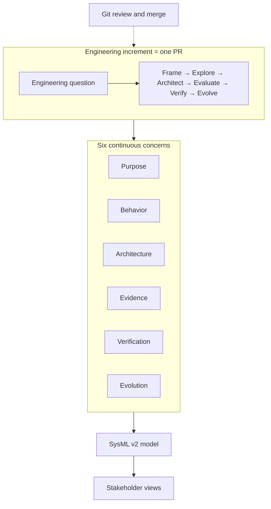

# Elan8 Method

[](LICENSE)

A lightweight, SysML v2-native methodology for continuous model-based systems engineering.

> Practical SysML v2 methodology for continuous model-based engineering. It connects stakeholder needs, system behavior, architecture, analysis, and verification in a machine-readable and reviewable engineering workflow.

---

## Why this methodology exists

SysML v2 is a powerful systems modeling language, but it does not prescribe a single way of working.

The Elan8 Method combines proven systems engineering practices with a modern Digital Engineering workflow based on SysML v2, text-based modeling, version control, automated quality checks, continuous analysis and verification, generated views, and human-reviewed AI assistance.

The methodology uses standard SysML v2 and can be applied with any conforming modeling environment. This repository contains its own method library, project template, guidance, and examples.

It is designed as a:

> **lightweight, modular, SysML v2-native MBSE methodology for continuous Digital Engineering.**

The central question is not “Which diagrams must we create?” but:

> Which engineering questions must we answer, which decisions must we make, and what evidence do we need?

---

## Newcomer quick start

1. Skim the [SysML v2 primer](docs/sysml-v2-primer.md) (definition/usage, satisfy/allocate/verify, views).
2. Read [principles](docs/principles.md), [six concerns](docs/concerns.md), and [engineering increments](docs/engineering-increments.md) (short).
3. Copy [templates/project-template](templates/project-template/) as a starting repository layout.
4. Read [requirements](docs/requirements.md), [behavior](docs/behavior.md), [architecture](docs/architecture.md), and [verification](docs/verification.md) as needed.
5. Start with the populated [guard-stop increment](examples/guard-stop/README.md), including shared requirements, two scenarios, and verification verdicts.

See also: [workflow loop](docs/workflow.md), [evidence and claims](docs/evidence-and-claims.md), [glossary](docs/glossary.md), [method mapping](docs/method-mapping.md), [roles and reviews](docs/roles-and-reviews.md).

---

## Method at a glance



- **Increment** = reviewable work unit in Git/PR ([engineering-increments.md](docs/engineering-increments.md)).
- **Concerns** = continuous perspectives, not phases ([concerns.md](docs/concerns.md)).
- **Evidence chain** = Claim → Evidence → Confidence → Decision ([evidence-and-claims.md](docs/evidence-and-claims.md)).
- **Example** = [guard-stop engineering increment](examples/guard-stop/README.md).

---

## Repository map

```text
mbse-methodology/
  README.md                 # this page
  docs/                     # principles, concerns, levels, tailoring, quality, migration
  library/                  # Elan8 SysML v2 method libraries
  templates/project-template/
  examples/                 # SE pattern fixtures
  scripts/                  # repository maintenance checks
```

| Area | Start here |
| --- | --- |
| SysML v2 primer | [docs/sysml-v2-primer.md](docs/sysml-v2-primer.md) |
| Principles | [docs/principles.md](docs/principles.md) |
| Six concerns | [docs/concerns.md](docs/concerns.md) |
| Requirements | [docs/requirements.md](docs/requirements.md) |
| Engineering increments | [docs/engineering-increments.md](docs/engineering-increments.md) |
| Workflow loop | [docs/workflow.md](docs/workflow.md) |
| Evidence and claims | [docs/evidence-and-claims.md](docs/evidence-and-claims.md) |
| Glossary | [docs/glossary.md](docs/glossary.md) |
| Method mapping | [docs/method-mapping.md](docs/method-mapping.md) |
| Abstraction levels | [docs/abstraction-levels.md](docs/abstraction-levels.md) |
| Tailoring | [docs/tailoring.md](docs/tailoring.md) |
| Roles and reviews | [docs/roles-and-reviews.md](docs/roles-and-reviews.md) |
| Quality rules | [docs/quality-rules.md](docs/quality-rules.md) |
| Quality diagnostic contract | [docs/quality-diagnostic-contract.md](docs/quality-diagnostic-contract.md) |
| Library migration | [docs/library-migration.md](docs/library-migration.md) |
| SysML libraries | [library/README.md](library/README.md) |
| KPAR release | Tag `v*` → GitHub Actions packs `library/` as `elan8-method-libraries-*.kpar` |
| Project template | [templates/project-template/](templates/project-template/) |
| Examples | [examples/](examples/) |

---

## Core goals

1. Connect stakeholder needs to architecture and verification.
2. Create consistent and reusable SysML v2 models.
3. Work incrementally instead of building disconnected model layers.
4. Expose assumptions, risks, and decisions.
5. Automate model quality checks.
6. Make engineering changes reviewable and traceable.
7. Generate useful views for different stakeholders.
8. Integrate modeling with simulation, testing, software, and domain engineering.
9. Use AI without losing human accountability.
10. Tailor MBSE effort to project size and risk.

---

## What this repository contains

- Eight principles and six continuous engineering concerns
- Soft abstraction-level guidance (operational / system / logical / physical)
- SysML method libraries under `Elan8Method`
- Project template with seven fixed engineering stages and supporting packages
- Modeling guidance connected to complete examples
- Quality-rule checklist and a tool-independent diagnostic contract
- Self-contained SE pattern fixtures and a populated guard-stop example

Project-specific vocabulary belongs in the project-local library or in explicitly selected external domain libraries. The included examples require only the method library and standard SysML v2 libraries.

---

## Where requirements fit

Requirements run through all seven stages and connect stakeholder intent to design and verification. Keep stakeholder needs, supplied customer/stakeholder requirements, and all engineering requirement levels together in `model/05_requirements`. Preserve source obligations and derive system requirements where needed; reference directly applicable supplied requirements without duplication. Stage packages reference these requirements and their subjects remain the relevant system, function, interface, or component. Each requirement has one canonical model location, with relationships and views connecting it to the other stages.

See [requirements](docs/requirements.md) for placement, traceability, and review guidance. Requirements use native SysML v2 constructs, with optional role annotations from `Metadata`; identifiers use native short names. Evidence references belong to `Verification`.

## SysML libraries

Canonical packages (import these in new models):

- `Elan8Method::Verification`
- `Elan8Method::Metadata`
- `Elan8Method::MethodCore`
- `Elan8Method::Viewpoints`

See [library-migration.md](docs/library-migration.md) for namespace and package updates.

Load `library/` alongside the copied template or example model in a SysML v2 environment with the matching standard libraries. No sibling repository is required. Configure library resolution using your environment's supported mechanism.

For a worked reading path, start with [examples/guard-stop](examples/guard-stop/README.md).

---

## Lessons from existing methodologies

Retained and adapted ideas from SYSMOD (practical modeling guidance and examples), OOSEM (scenario-driven increments), and Arcadia (need vs solution, viewpoints)—with less diagram-centrism, less tool lock-in, and one semantic network rather than duplicated layer models. Practice is illustrated by the worked example and supported by the method library; see [method-mapping.md](docs/method-mapping.md).

---

## Modeling environment capabilities

Useful capabilities include import/type resolution, model validation, requirement coverage, stakeholder views, semantic change review, and automated checks in CI. The methodology defines engineering expectations independently of how a particular environment implements them.

Treat a quality rule as a review checklist unless your chosen validator implements it. Parsing successfully does not establish requirement coverage, evidence validity, or passing verification results.

---

## Definition of success

A small team can start a SysML v2 project without inventing its own structure, model one end-to-end concern using the template and worked example, review architecture and verification coverage, and evolve the model under version control with automated checks where available.

---

## License

MIT. See [LICENSE](LICENSE).
