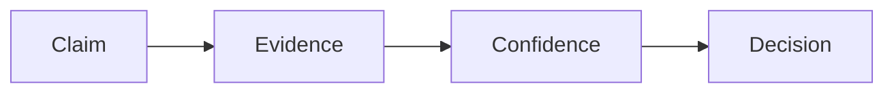

# Evidence and claims

The **Evidence** concern answers: *what do we know, how well do we know it, and what decision does that support?*

Use a short chain so Evidence does not become a dump of every analysis, document, and test log:

```text
Claim → Evidence → Confidence → Decision
```



## Claim

A statement that matters to the design or assurance of the system.

Examples:

- the architecture satisfies the maximum mass requirement;
- cliff detection stops the robot within the timing budget;
- the selected MCU meets the localization compute load.

In the model, a claim is often carried by:

- a `require constraint` on a requirement;
- an analysis objective;
- a `doc` statement tied to a named element;
- a verification objective.

Keep claims **specific and falsifiable**.

## Evidence

Material that supports or refutes a claim.

Examples:

- analysis case result (with assumptions);
- simulation run referenced by URI;
- physical or software test record;
- supplier datasheet / calculation note;
- inspection or review record (when that is the agreed method).

Prefer `Elan8::Method::Requirements::VerificationEvidence` (name + `evidenceUri`) and analysis elements in `40_analysis/` over embedding large datasets in SysML.

Evidence should state (in the model or at the URI):

- what was evaluated;
- under which assumptions / configuration;
- where the full artifact lives.

## Confidence

How strongly the evidence supports the claim **for the current decision**.

Capture confidence lightly:

- in analysis/verification `doc`;
- via assumptions (`@Assumption`) that bound validity;
- via risks (`@Risk`) when confidence is low;
- in the PR discussion for the increment.

Do not invent a mandatory confidence metadata stereotype unless a regulated profile requires it. Honesty beats false precision.

Examples of confidence language:

- “Preliminary; CAD mass not yet reconciled.”
- “Lab test on revision B hardware; firmware build 1.4.”
- “Analysis only; physical test planned in a follow-up increment.”

## Decision

What we do with the claim given the evidence and confidence.

Record product decisions with `@DecisionRecord` (`decisionId`, `title`, `rationale`).  
**Approval** of the decision is the Git/PR merge (no `status` field on the metadata).

A decision may:

- accept the architecture option;
- defer work to a later increment;
- reject an alternative;
- raise a new requirement or risk.

## Mapping to concerns

| Chain step | Typical concerns |
| --- | --- |
| Claim | Purpose, Behavior, Architecture, Verification |
| Evidence | Evidence, Verification |
| Confidence | Evidence, Evolution |
| Decision | Architecture, Evolution |

## Increment checklist

For each [engineering increment](engineering-increments.md):

- [ ] Critical claims for the engineering question are explicit
- [ ] Each critical claim has evidence or a stated gap
- [ ] Confidence / assumptions are visible to a reviewer
- [ ] Resulting decisions use `@DecisionRecord` when they change the product baseline

## Anti-patterns

- Evidence concern used as a folder for every PDF
- Claims only in chat or slide decks
- “Verified” without a verification case or evidence URI
- Decision rationale only in a meeting invite

## Related

- [concerns.md](concerns.md) — Evidence and Verification
- [engineering-increments.md](engineering-increments.md)
- [quality-rules.md](quality-rules.md)
- Showcase: vacuum `SafetyReactionAnalysis` + `verifyCliffSafeStop`
