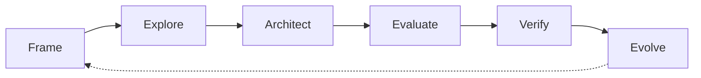

# Workflow loop

Default working loop for each [engineering increment](engineering-increments.md).

Concerns remain continuous and non-linear. This loop is a **repeatable path through an increment**, not a project waterfall.

```text
Frame → Explore → Architect → Evaluate → Verify → Evolve
```



## Frame

Clarify:

- the engineering question;
- system scope;
- stakeholders;
- concerns;
- constraints;
- success criteria.

Typical recipes: [define-system-purpose](../recipes/define-system-purpose.md), [define-system-context](../recipes/define-system-context.md), [capture-stakeholder-concerns](../recipes/capture-stakeholder-concerns.md).

## Explore

Develop:

- scenarios;
- use cases;
- behavior;
- operational context;
- exceptional and degraded situations;
- candidate requirements.

Typical recipes: [model-operational-scenario](../recipes/model-operational-scenario.md), [model-degraded-behavior](../recipes/model-degraded-behavior.md), [derive-system-requirements](../recipes/derive-system-requirements.md).

## Architect

Define:

- responsibilities;
- logical structure;
- interfaces;
- physical realization;
- allocations;
- variants (when needed).

Typical recipes: [create-logical-architecture](../recipes/create-logical-architecture.md) and related architecture recipes.

## Evaluate

Assess:

- assumptions;
- alternatives;
- risks;
- calculations / simulation results;
- trade-offs;
- decision rationale (`@DecisionRecord` — no approval `status` in the model; merge records acceptance).

Typical recipes: [evaluate-architecture-alternative](../recipes/evaluate-architecture-alternative.md), [record-architecture-decision](../recipes/record-architecture-decision.md).

See also [evidence-and-claims.md](evidence-and-claims.md).

## Verify

Define and collect:

- verification cases;
- acceptance criteria;
- coverage of the increment’s question;
- evidence URIs;
- compliance or test results (as references, not bulk data in SysML).

Typical recipes: [define-requirement-verification](../recipes/define-requirement-verification.md).

## Evolve

Manage:

- PR review and merge;
- model follow-ups;
- baselines / tags;
- ownership (CODEOWNERS);
- residual risks and next increment question.

See [roles-and-reviews.md](roles-and-reviews.md) and [engineering-increments.md](engineering-increments.md).
