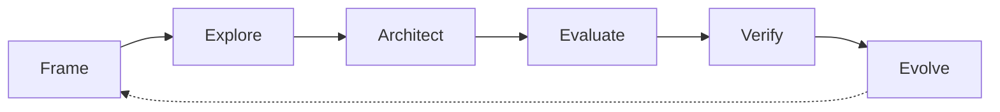

# Workflow loop

Default working loop for each [engineering increment](engineering-increments.md).

Concerns remain continuous and non-linear. This loop is a **repeatable path through an increment**, not a project waterfall.

```text
Frame → Explore → Architect → Evaluate → Verify → Evolve
```


```mermaid
flowchart LR
  Frame --> Explore --> Architect --> Evaluate --> Verify --> Evolve
  Evolve -.-> Frame
```

## Frame

Clarify:

- the engineering question;
- system scope;
- stakeholders;
- concerns;
- constraints;
- success criteria.

Separate the existing problem, desired stakeholder outcome, and candidate solution. Identify the system boundary, stakeholders, external interactions, assumptions, and exclusions. Capture stakeholder concerns and frame them with the needs they motivate; avoid treating a stakeholder wish as an implementation choice.

## Explore

Develop:

- scenarios;
- use cases;
- behavior;
- operational context;
- exceptional and degraded situations;
- candidate requirements.

See [behavior](behavior.md) and [requirements](requirements.md) for actor goals, scenario paths, and measurable obligations.

## Architect

Define:

- responsibilities;
- logical structure;
- interfaces;
- physical realization;
- allocations;
- variants (when needed).

See [architecture](architecture.md) for responsibilities, interface contracts, allocations, and layer tailoring.

## Evaluate

Assess:

- assumptions;
- alternatives;
- risks;
- calculations / simulation results;
- trade-offs;
- decision rationale (`@DecisionRecord` — no approval `status` in the model; merge records acceptance).

See [architecture decisions](architecture.md#alternatives-and-decisions) for criteria, comparison, and rationale.

See also [evidence-and-claims.md](evidence-and-claims.md).

## Verify

Define and collect:

- verification cases;
- acceptance criteria;
- coverage of the increment’s question;
- evidence URIs;
- compliance or test results (as references, not bulk data in SysML).

See [verification](verification.md) for case definitions, observations, verdicts, evidence, and coverage.

## Evolve

Manage:

- PR review and merge;
- model follow-ups;
- baselines / tags;
- ownership (CODEOWNERS);
- residual risks and next increment question.

See [roles-and-reviews.md](roles-and-reviews.md) and [engineering-increments.md](engineering-increments.md).
